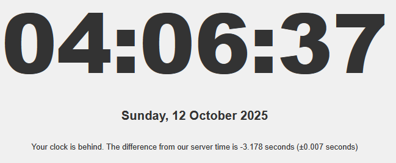

# Real Clock

A minimalistic accurate clock. Shows the exact real time even if your local time is incorrect. It fetches the correct time from the web server server and compensates for network latency.

The color changes at each multiple of 5 seconds to assist in synchronizing a physical watch or clock.

[Live Demo](https://time.gock.net/)

## Install

I use [pnpm](https://pnpm.io/) as my package manager. You can also use npm or yarn instead if you prefer.

    pnpm install
    node app.js

This will start the server on port `3007` by default. You can change the port by setting the `PORT` environment variable before starting the server.

## Static Files

The server serves the static clock page from the `public/` directory. You can access it by navigating to:

    http://localhost:3007/

## API Endpoint

The server provides an API endpoint at `/api/time` that returns a JSON object with two properties: `milliseconds` and `datetime`.

- `milliseconds` represents the current time in milliseconds past Unix epoch.
- `datetime` represents the current date and time in UTC format with milliseconds included.

Example request:

    curl http://localhost:3007/api/time

Example response:

    {
      "milliseconds": 1648594225793,
      "datetime": "2023-03-29T22:50:25.793Z"
    }

## Rate limiting

This server uses the express-rate-limit middleware to rate-limit requests.

- Global Limit: The server allows up to 500 requests per minute across all clients.
- Per-IP Limit: Each IP address is limited to 50 requests per minute.

If a client exceeds these limits, the server will respond with a `429 Too Many Requests` status code.

This can be adjusted in `app.js` by changing the values in the `globalLimiter` and `perIpLimiter` configuration.

## Using PM2

If using PM2, you can use the following to start the server on port `3007` and name it `realclock`:

    PORT=3007 pm2 start ./app.js --name "realclock"

And to stop or remove it:

    pm2 stop realclock
    pm2 delete realclock

## Keep server time accurate

On Ubuntu 22.04, you can use `chronyd` to keep the server time accurate. Install it with:

    apt install chrony

Then start and enable it to run on boot. The system may already have it enabled after install.

    systemctl start chronyd
    systemctl enable chronyd

Force a sync with:

    chronyc -a makestep

You can check the status of `chronyd` with:

    chronyc tracking

Add regular sync to crontab, add to `/etc/crontab`:

    */10 * * * * root chronyc -a makestep

## License

This project is licensed under the MIT License. See the LICENSE file for details.
